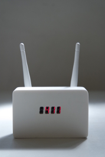

# Linger #

The project page can be found [here](https://jaspervanloenen.com/linger/).

## Short description ##

Most mobile devices — such as smartphones — are always searching
for wifi networks they have been connected to in the past. Your
phone is basically yelling every name of every network it has ever
been connected to — at home, at the office or at that hotel with
the dodgy connection — to see if it will get a response from the router.
These messages contain enough unique information\* to be used to
fingerprint and track individuals, something that is already being
done by many different parties, and for various reasons. Shops for
instance, use this data to track how many people walk by, how many
actually come into the store, and how much time you’ve spent in the
candy aisle before making your choice.

Linger is a small, portable device that allows you to create and
blend into a virtual crowd by storing the specific wifi signals
from everyone that comes near you, and rebroadcasting their signals
infinitely when they leave, making it seem as if they are still there.
As you pass people in the street and their signals are stored in the
database, a small display on the device automatically updates to show
the number of unique individuals in your group.

Physically they may have left, but their virtual presence will stay with you forever.

\* This information can be faked (like Linger is doing) and some
software even allows you to turn these signals off completely, but
most devices will send these signals by default (including iPhones
and most Android devices).

## Short description (tech version) ##
Linger listens for and stores probe requests coming from WIFI enabled
devices within range into an sqlite database. When these devices
leave the area (determined by the time since their last probe
request) it will start resending the saved probe requests
(with updated sequence numbers), tricking other listeners
into thinking the device is still there.

## Long description ##
Most WIFI enabled devices remember the names of all wireless
networks they have been connected to in the past. Whenever
your device is on, but not connected to a network (or sometimes
even when connected), it will broadcast the names of these known
networks (so called probe requests). In theory, when a router
notices a device calling out its name, it will respond by saying
it's there and a connection will be set up.

In practice, this broadcasting of networks names is not needed.
Routers often broadcast their own presence anyway (you know, that
list of network names you can select from when you turn on your
wifi). So instead of asking for known networks, your device can
also wait and listen to find out if a known router is nearby.

The problem with actively sending out probe request is that those
messages contain a 'unique' device number and the name of the network
your device wants to connect to. This can act as a fingerprint to
your device, and by using one of many geolocation databases with
network names, it is trivial to find out where a device (and so,
its user) has been before (think of names like "The Hague Airport",
or "some company name")- a tactic uses by shops and other
commercial parties to track people.

Linger listens for, and saves, probe requests coming from all WIFI
enabled devices that are within reach. When these devices leave
the area (determined by the time since their last probe request)
it will start resending the saved probe requests, tricking others
that might be listening into thinking the other device is still there.

The more devices linger sees, the larger its collection of saved probe
requests will become. This way, a virtual crowd of people will linger
and grow around the device.#

## Hardware Setup

The device uses a 7-segment LED display, a Raspberry Pi Zero, two TL-WN722N Wifi dongles and a powered USB hub. The powered hub is needed because the Pi can't provide enough power to run both Wifi dongles.

A simple explaination of how to connect the 7-segment display and some example code can be found [here](https://raspberrytips.nl/tm1637-4-digit-led-display-raspberry-pi/).
After I checked eveything was working, I stripped the cases off of the Wifi dongles and USB hub, removed the USB sockets from the PCBs and connected all of the different parts by small wires to save space. I've put some cardboard inbetween the different components to prevent any shorts.

I've also soldered in a single full-size female USB A port; I used this to connect a USB-to-ethernet adapter for easy access to the Pi. A small momentary switch was also added to power off the device. I used the first scematic on [this page](http://www.raspberry-pi-geek.com/Archive/2013/01/Adding-an-On-Off-switch-to-your-Raspberry-Pi).

## Software Setup

There are three parts to this script:
* `linger_rx`: receives probe requests and saves them to `probes.sqlite` by default
* `linger_tx`: transmits probe requests found in the database
* `linger_counter`: gets the amount of unique MAC addresses in the database
and shows this on a 7-segment display.

Copy the three `.sh` files to `/etc/init.d/`. Make sure they are executable
(`chmod +x linger_*`). Then register them so they are started after booting
by running `sudo update-rc.d <filename> defaults` for each of the three files.

To power down the device I used the code [found here]( and the code [shown here](http://www.raspberry-pi-geek.com/Archive/2013/01/Adding-an-On-Off-switch-to-your-Raspberry-Pi/(offset)/5)). After pressing my power button the display turns off to show the shutdown script is running, and after about 30 seconds it is safe to remove the power cable.

## Links:
* To create the startup scripts I used [a tutorial by Stephen C Phillips](http://blog.scphillips.com/posts/2013/07/getting-a-python-script-to-run-in-the-background-as-a-service-on-boot/).
* The script to control a tm1637 7-segment display from Python is a modified version of a script by [Richard IJzermans](https://raspberrytips.nl/tm1637-4-digit-led-display-raspberry-pi/).
* The scematic and code for the power button come from [Raspberry Pi Geek](http://www.raspberry-pi-geek.com/Archive/2013/01/Adding-an-On-Off-switch-to-your-Raspberry-Pi).
